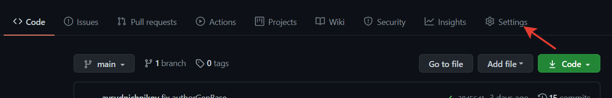
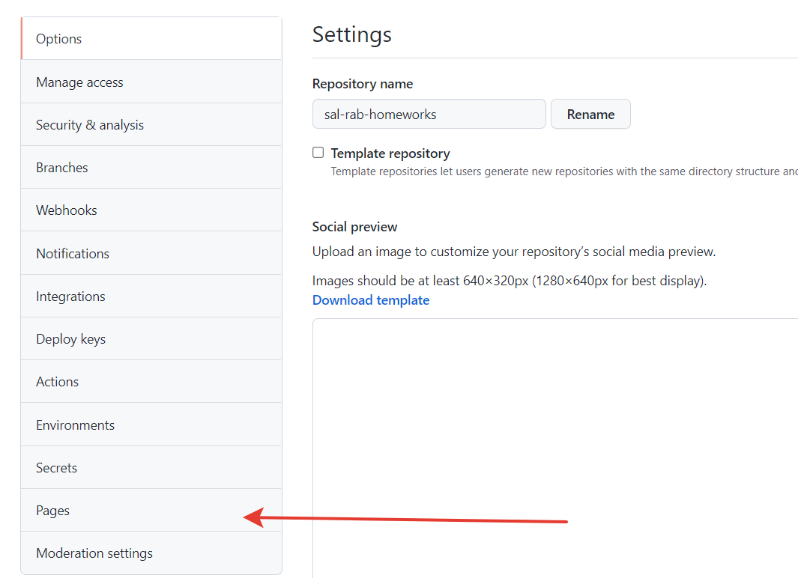
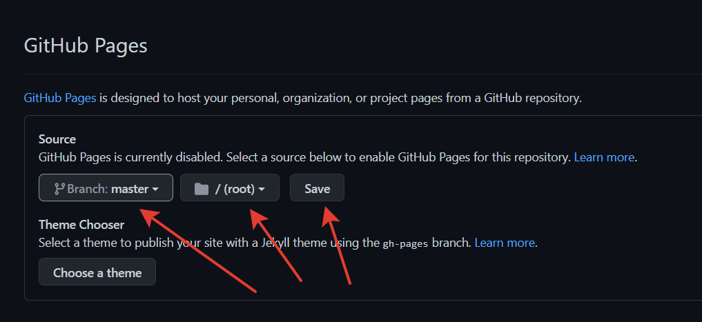

## Отправка на проверку
На проверку каждый раз отправляете:
- ссылку на репозиторий на GitHub;
- ссылку на развернутый на GitHub Pages проект.

### 1. GitHub
Вам требуется сохранить изменения, совершенные в
локальном репозитории, в удаленный репозиторий (в ваш форк).
Например, это можно сделать с помощью следующих команд Git:
- `git add`;
- `git commit -m 'task №1 done'`;
- `git push` или при необходимости `git push -u origin main`.

### 2. GitHub Pages
Вам требуется разместить свой сайт в интернет,
для этого в настройках репозитория:
1. Переходим в настройки вашего форка репозитория
   
2. Выбираем пункт Pages
   
3. Выберите ветку `master`, директорию `(root)` и нажмите
   кнопку "Сохранить":
   
