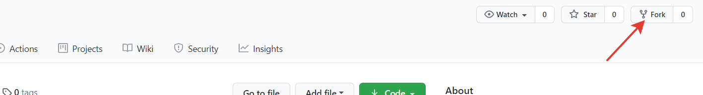

# Задания к блоку "Введение в разработку" курса "Системный аналитик"
## Легенда
После окончания обучения вашим первым проектом стал сервис доставки еды из ресторана 
"Суши из Хрюши". Но за две недели до релиза уволился фронтенд-разработчик. 
Руководитель разработки пролистал резюме всей команды еще раз и увидел, что вы 
указали в своём знание Javascript. Разумеется, никто с вас не требует довести проект
до совершенства, но некоторые баги срочно требуется решить. 

Хорошо, что разработчик написал комментарии по каждой ошибке, есть шанс, что
вы справитесь, если вспомните то, чему вас в свое время научили в "Нетологии".

## Общие для всех заданий положения
### Редактор кода
Программный код можно писать и в блокноте, но рекомендуется выполнять задания по 
разработке с  помощью профессиональных инструментов, например, 
[Visual Studio Code](https://code.visualstudio.com/).

### Репозиторий
Для начала работы над заданиями создайте форк этого репозитория и работайте в нём.

После этого клонируйте репозиторий себе на компьютер.

Это действие требуется выполнить единожды!

Для проверки не забывайте отправлять изменения в свой репозиторий.

### Автоматическая проверка
Автоматические тесты используются для самостоятельной проверки слушателем решения.

Автоматические тесты не исключают проверку кода преподавателем, однако, благодаря 
им, значительно увеличивается скорость принятия решений.

Для самостоятельной проверки решений в каждое задание добавлен файл test-runner.js

Для его использования вам требуется просто открыть его в браузере.

Если ваше решение не проходит какие-то тесты, то они будут отображены на странице.

После изменения решения, требуется обновить страницу с тестами для перепроверки 
либо открыть ее заново.

Решения, которые не проходят автоматические тесты, преподавателем не проверяются!

### Визуальное отображение
В каждом задании требуется произвести определенные улучшения имеющегося проекта.

Для того, чтобы посмотреть результат, нужно открыть файл index.html в корне 
проекта.

### GitHub Pages
Для того, чтобы разместить свой сайт в интернет, требуется в настройках репозитория 
включить github-pages, выбрав в качестве ветки для публикации "main", и нажать 
"Сохранить":

## Задания
[1. Задание к занятию "Введение в разработку ПО"](task_1/readme.md)

[2. Задание к занятию "Логика и ветвления"](task_2/readme.md)

[3. Задание к занятию "Сложные структуры данных"](task_3/readme.md)

[4. Задание к занятию "Циклы и производительность"](task_4/readme.md)

[5. Итоговое задание "Подготовка данных к отправке"](task_5/readme.md)
