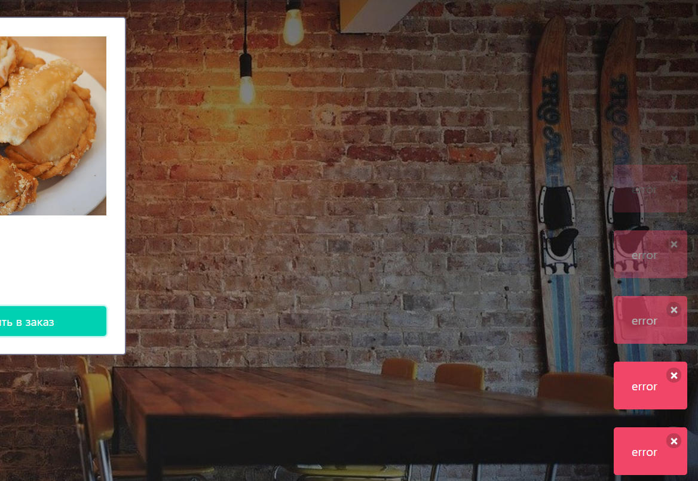
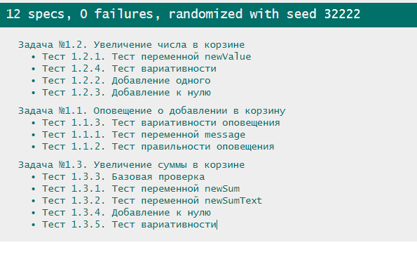

## Задания к занятию "Введение в разработку ПО"
Пишите код решения в файле `task_1/solution.js`

Автотесты запускаются в файле `task_1/test-runner.html`

Не забудьте перед выполнением задания ознакомиться
информацией, которая может потребоваться
для выполнения любого задания модуля:

[1. Начало работы на модуле](../before.md)

[2. Руководство по стилю кода](../styleguide.md)

[3. Тестирование решений](../test.md)

[4. Отправка на проверку](../after.md)

### Задание №1.1. Оповещение о добавлении в корзину

#### Задача
При добавлении товара в корзину, вместо всплывающего сообщения
о том что товар добавлен, всплывает сообщение об ошибке:

Дело в том, сообщение о добавлении в корзину формируется неверно.

Исправьте эту проблему.

#### Ход решения
Пишите весь код решения между строками 
"Задание №1.1." и 
"Конец решения задания №1.1."
1. Cоздайте переменную message
2. Присвойте переменной message значение переменной productName
3. Добавьте в конец переменной message пробел
4. Добавьте в конец переменной message текст 'за'
5. добавьте в конец переменной message пробел
6. Добавьте в конец переменной message значение переменной productPrice
7. Добавьте в конец переменной message пробел
8. Добавьте в конец переменной message текст 'теперь в корзине!'
9. Выведите переменную message в консоль

### Задание №1.2. Увеличение количества в корзине

#### Задача
При добавлении товара в корзину, не увеличивается количество товаров в корзине:

Требуется исправить, чтобы при каждом добавлении товара количество товара увеличивалось:

#### Ход решения
Пишите весь код решения между строками 
"Задание №1.2." и 
"Конец решения задания №1.2."
1. Создайте переменную newValue
2. Присвойте ей значение oldValue
4. Увеличьте значение newValue на 1

### Задание №1.3. Увеличение суммы в корзине

#### Задача
При добавлении товара в корзину, не увеличивается стоимость товара в корзине:

Требуется исправить, чтобы при каждом добавлении товара сумма стоимости товаров 
увеличивалась:

#### Ход решения
Пишите весь код решения между строками
"Задание №1.3." и 
"Конец решения задания №1.3."
1. Создайте переменную newSum и присвойте ей сумму oldSum и difference
2. Создайте переменную newSumText и присвойте ей результат склеивания переменной newSum и текста ' ₽'
3. Замените склеивание, используемое в newSum Text на шаблонную строку ("косые кавычки")

### Как отправить решения на проверку
1. Проверьте правильность решения с помощью автотестов task_1/test-runner.html

2. Если обнаружены какие-то ошибки - исправьте их и проверьте решение снова
3. Отправьте изменения в удаленный репозиторий
4. Отправьте преподавателю на проверку ссылку на github и ссылку на github-pages 
