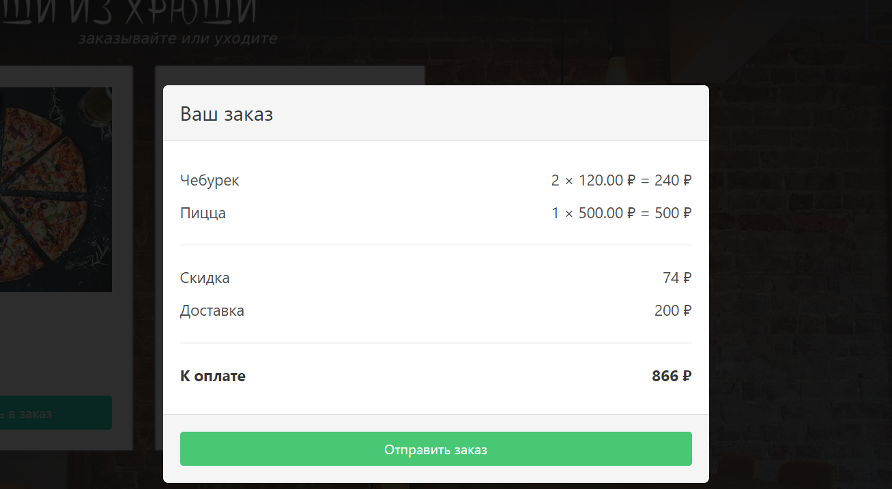
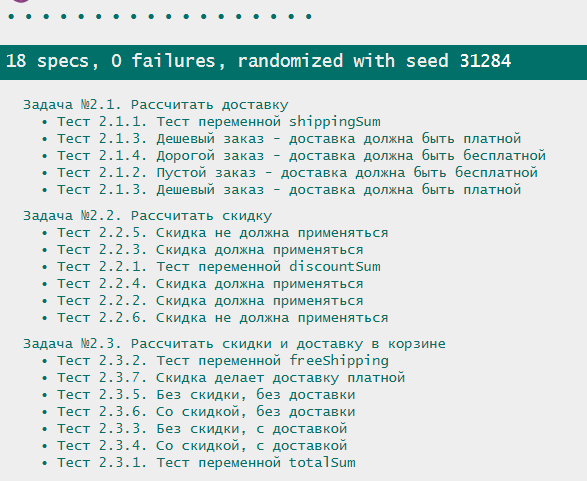

## Задания к занятию "Логика и ветвления"
Пишите код решения в файле `task_2/solution.js`

Автотесты запускаются в файле `task_2/test-runner.html`

Не забудьте перед выполнением задания ознакомиться
информацией, которая может потребоваться
для выполнения любого задания модуля:

[1. Начало работы на модуле](../before.md)

[2. Руководство по стилю кода](../styleguide.md)

[3. Тестирование решений](../test.md)

[4. Отправка на проверку](../after.md)
`
### Задание №2.1. Рассчитать доставку
#### Задача
При клике на корзину открывается информация о заказанных позициях, 
стоимости доставки и предоставленных скидках.
В настоящее время стоимость доставки не считается.

Доставка должна стоить 200 рублей.
Если в корзине пусто, то и доставка бесплатна.
Если заказ сделан более чем на 700 рублей, то доставка бесплатна.

Используйте переменные на случай, если в будущем изменят минимальную 
стоимость для бесплатной доставки или стоимость доставки.

#### Ход решения
Пишите весь код решения между строками 
"Задание №2.1." и 
"Конец решения задания №2.1."
1. если productsSum равно 0, то shippingSum присвоить значение 0;
2. если productsSum больше или равен freeShippingMinSum,
то shippingSum присвоить значение 0.
3. В остальных случаях shippingSum присваивать значение shippingPrice

### Задание №2.2. Увеличение количества в корзине
#### Задача
При клике на корзину открывается информация о заказанных позициях, 
стоимости доставки и предоставленных скидках.
В настоящее время стоимость скидки не считается.

Скидка предоставляется, если стоимость заказа не менее 700 рублей и составляет 10%.

Используйте переменные на случай, если в будущем изменят минимальную 
стоимость для скидки или ее размер.

#### Ход решения
Пишите весь код решения между строками 
"Задание №2.2." и 
"Конец решения задания №2.2."
1. создайте переменную discountSum
2. если productsSum больше или равно discountMinSum,
то присвойте discountSum значение discountPart процентов от productsSum,
иначе присвойте discountSum значение 0

### Задание №2.3. Увеличение суммы в корзине
#### Задача
При клике на корзину открывается информация о заказанных позициях, 
стоимости доставки и предоставленных скидках.

В этом задании требуется объединить скидку и доставку: 
рассчитать стоимость скидки,  доставки и бесплатная ли доставка.
Доставка считается после расчета скидки.

#### Ход решения
Пишите весь код решения между строками
"Задание №2.3." и 
"Конец решения задания №2.3."
1. Создайте переменную totalSum
2. Присвойте totalSum значение productsSum
3. Уменьшите totalSum на discountSum
4. Прибавьте к totalSum значение shippingSum
5. Создайте переменную freeShipping
6. Запишите без использования if или любых других условий
7. Если shippingSum равно нулю, 
то freeShipping должна быть равна true, 
иначе freeShipping должна быть равна false

### Как отправить решения на проверку
1. Проверьте правильность решения с помощью автотестов task_2/test-runner.html

2. Если обнаружены какие-то ошибки - исправьте их и проверьте решение снова
3. Отправьте изменения в удаленный репозиторий
4. Отправьте преподавателю на проверку ссылку на github и ссылку на github-pages 
