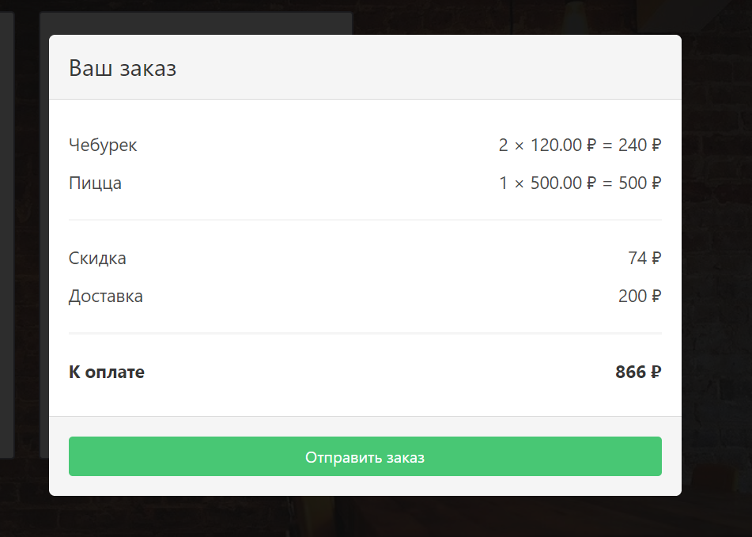

## Задания к занятию "Сложные структуры данных"
Пишите код решения в файле `task_3/solution.js`

Автотесты запускаются в файле `task_3/test-runner.html`

Не забудьте перед выполнением задания ознакомиться
информацией, которая может потребоваться
для выполнения любого задания модуля:

[1. Начало работы на модуле](../before.md)

[2. Руководство по стилю кода](../styleguide.md)

[3. Тестирование решений](../test.md)

[4. Отправка на проверку](../after.md)

### Задание №3.1. Рассчитать доставку
#### Задача
Сейчас в корзине выводится список товаров в корзине не самым лучшим образом.
Требуется изменить это:

#### Ход решения
Пишите весь код решения между строками 
"Задание №3.1." и 
"Конец решения задания №3.1."
Сформируйте строку itemCountText вида 
`// количество × цена ₽ = стоимость ₽`
на основе объекта item, например:
`5 × 500.00 ₽ = 2500 ₽`

1. Создайте переменную itemCountText, равную пустой строке
2. Присвойте переменной itemCountText результат склеивания itemCountText и количества
3. Присвойте переменной itemCountText результат склеивания itemCountText и ` × `
4. Присвойте переменной itemCountText результат склеивания itemCountText и цены
5. Присвойте переменной itemCountText результат склеивания itemCountText и ` ₽ = `
6. Создайте переменную sum и присвойте ей значение произведения количества и цены
7. Присвойте переменной itemCountText результат склеивания itemCountText и sum
8. Присвойте переменной itemCountText результат склеивания itemCountText и ` ₽`

### Как отправить решения на проверку
1. Проверьте правильность решения с помощью автотестов task_3/test-runner.html
2. Если обнаружены какие-то ошибки - исправьте их и проверьте решение снова
3. Отправьте изменения в удаленный репозиторий
4. Отправьте преподавателю на проверку ссылку на github и ссылку на github-pages 
